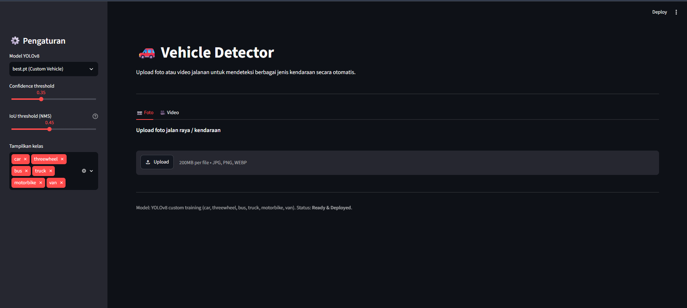

# 🚗 Vehicle Detector

Deteksi otomatis **mobil**, **motor**, **bus**, **truk**, **van**, dan **kendaraan roda tiga (threewheel)** dari foto jalan raya menggunakan model kustom **YOLOv8** + **Streamlit**. Dibuat sebagai fondasi untuk sistem pemantauan lalu lintas (*traffic monitoring*) berbasis *Computer Vision*.


## 📸 Preview

<!-- Ganti dengan screenshot hasil deteksi Streamlit kamu -->


## ✨ Fitur

- Upload foto jalan raya langsung melalui antarmuka browser
- Deteksi 6 kelas kendaraan (`car`, `threewheel`, `bus`, `truck`, `motorbike`, `van`) menggunakan model YOLOv8 hasil *custom training*
- *Filtering* kelas kendaraan yang ingin ditampilkan secara spesifik
- Pengaturan *Confidence Threshold* dan *IoU Threshold* (NMS) yang bisa diatur secara *real-time* dari *sidebar*
- Ringkasan jumlah kendaraan yang berhasil dideteksi secara otomatis

## 🚀 Quickstart

```bash
git clone [https://github.com/rizqy-fadhil/vehicle-detector.git](https://github.com/rizqy-fadhil/vehicle-detector.git)
cd vehicle-detector

# Sangat disarankan menggunakan Conda dengan Python 3.10
conda create -n yolo_env python=3.10 -y
conda activate yolo_env

pip install -r requirements.txt
python -m streamlit run app.py
```

Buka `http://localhost:8501` di browser, upload foto lalu lintas, dan lihat hasilnya.

Catatan: Model yang digunakan adalah `best.pt` hasil training kustom yang tersimpan di dalam direktori runs/.

## 📁 Struktur Folder
```
vehicle-detector/
├── app.py                   # Script antarmuka Streamlit
├── requirements.txt         # Daftar dependencies
├── data.yaml                # Konfigurasi dataset
├── classes.txt              # Daftar kelas kendaraan
└── runs/
    └── detect/
        └── train/
            └── weights/
                └── best.pt  # Model custom YOLOv8
```

## 🧠 Cara Kerja
1. Model YOLOv8 dilatih (custom training) menggunakan dataset kendaraan dengan dukungan PyTorch CUDA untuk memprediksi 6 kelas berbeda.
2. Parameter Confidence menentukan tingkat kepercayaan minimum prediksi, sedangkan IoU mengatur ketatnya Non-Maximum Suppression (menghilangkan kotak ganda).
3. Semua pengaturan threshold dan filter kelas dikontrol pengguna langsung melalui sidebar interaktif Streamlit.

## 🔧 Roadmap / Pengembangan Lanjutan
- [ ] Integrasi pemrosesan video frame-by-frame di Streamlit (membutuhkan penanganan temporary file)
- [ ] Menambahkan fitur Vehicle Counting (menghitung volume kendaraan yang lewat garis pembatas)
- [ ] Fine-tuning model dengan dataset lalu lintas lokal (kondisi jalanan Indonesia)
- [ ] Dukungan RTSP live stream untuk integrasi langsung ke CCTV jalan raya

## 📄 Lisensi
MIT — bebas dipakai, dimodifikasi, dan disebarluaskan.
